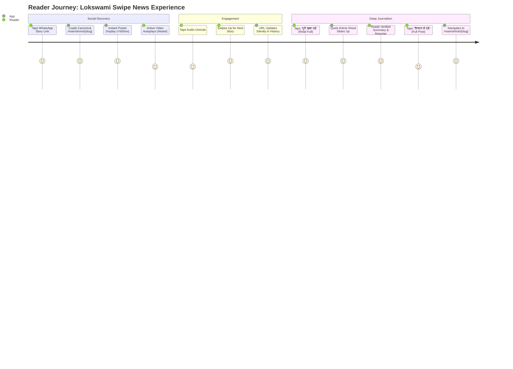
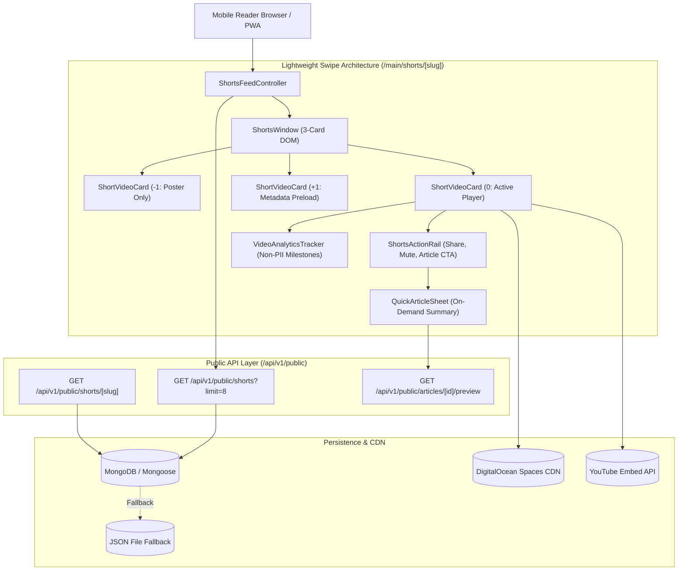
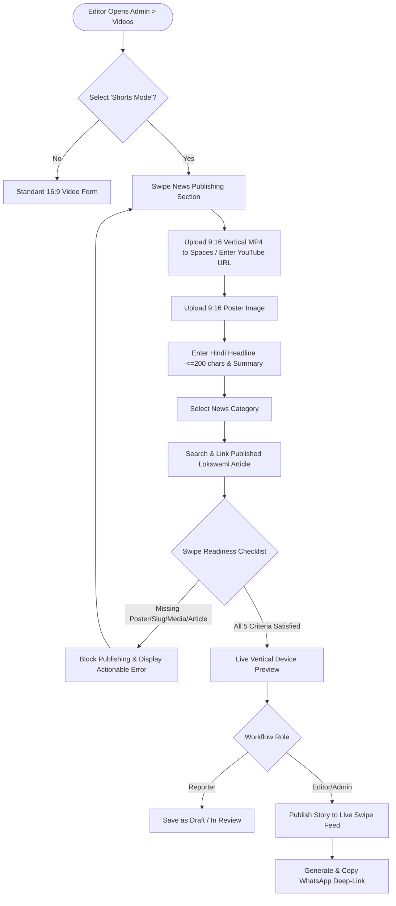

# Lokswami Swipe News 1.0 — September 2026 Implementation & Beta Launch Plan

> **Product**: Lokswami Swipe (लोकस्वामी स्वाइप)  
> **Tagline**: देखो • पढ़ो • आगे बढ़ो  
> **Plan Identifier**: Lokswami Swipe News 1.0  
> **Target Release Window**: September 1–30, 2026  
> **Public Route**: `/main/shorts/[slug]`  
> **Feature Flag**: `SWIPE_BETA_ENABLED=true`  
> **Repository Seam**: Next.js 15 App Router Modular Monolith (`zaidshery/Zaid-lokswami`)  
> **Document Status**: Approved Technical Implementation Plan (Ready for Phase-by-Phase Execution)

---

## 1. Executive Summary

Lokswami is a Hindi news digital platform and Progressive Web Application (PWA) built on Next.js 15 App Router, TypeScript, Tailwind CSS, and a dual-storage persistence architecture (MongoDB/Mongoose with file-store fallbacks).

**Lokswami Swipe News 1.0** upgrades the platform's vertical video capabilities into a dedicated, high-performance news reading experience. The product combines full-screen vertical video storytelling with immediate, one-tap access to verified Hindi journalism.

### Strategic Positioning: Upgrade, Not Rebuild
This plan is **not a rebuild from zero**. The repository already provides:
- Next.js 15 App Router architecture with route groups (`(reader)`, `(admin)`, `(auth)`, `(marketing)`)
- TypeScript and Tailwind CSS styling system
- Dual MongoDB and file-store (`data/videos.json`) persistence with `isMongoAvailable` availability gating
- Existing Video CMS with four-role newsroom workflow (reporter, editor, admin, super-admin)
- Existing `VideoShortsFeed` component with snap-scroll and touch gesture foundations
- Cursor-based pagination for video and shorts endpoints
- Progressive Web App (PWA) installation prompts and service worker precaching
- S3-compatible DigitalOcean Spaces storage integration with direct signed browser uploads
- Hostinger standalone release manager and Vercel CI/CD pipelines

September 2026 delivers a focused, backward-compatible production upgrade:
1. Transforming the mobile shorts viewer into a dedicated, lightweight 3-card sliding window (`/main/shorts/[slug]`).
2. Establishing a canonical, cached Shorts API (`/api/v1/public/shorts`).
3. Connecting every vertical video to a peer-reviewed, published Lokswami news report via a persistent Hindi CTA (**पूरी खबर पढ़ें**).
4. Eliminating misleading UI behaviors (fabricated view counts, unbacked likes, phantom quality options).
5. Qualifying the public beta with at least 20 real vertical news reports under strict performance, accessibility, and reliability budgets.

---

## 2. Current Repository Assessment

A thorough inspection of the active repository structure, commit history, and working tree confirms the baseline architecture:

```text
========================================================================================
CURRENT REPOSITORY FOOTPRINT (AUDITED SEPTEMBER 2026)
========================================================================================
Layer                 Current Implementation                           Assessment
----------------------------------------------------------------------------------------
Framework             Next.js 15.1.0 App Router, Node.js 20.x          Production Ready
Reader Routes         app/(reader)/main/videos/page.tsx                Monolithic (1,891 lines client)
                      app/(reader)/main/shorts/[slug]/page.tsx         Dedicated route in progress
CMS Routes            app/(admin)/admin/videos/new & edit              Workflow-enabled video CMS
APIs                  app/api/shorts/latest/route.ts                   Legacy endpoint (active)
                      app/api/v1/public/shorts/route.ts                Canonical cursor endpoint
Data Persistence      lib/models/Video.ts & lib/storage/videosFile.ts  MongoDB + JSON file fallback
Storage & CDN         DigitalOcean Spaces S3 API + YouTube Embeds      Active production storage
PWA & Service Worker  public/sw.js & InstallAppPrompt.tsx              App shell active; media excluded
Deployment            Hostinger standalone + GitHub Actions CI         Zero-downtime release overlap
========================================================================================
```

### Verified Facts vs. Phase 0 Measurements
To maintain strict engineering rigor, this plan distinguishes verified repository facts from dynamic numbers that must be measured on live production builds:

- **Verified Fact**: `VideosPageClient.tsx` is an 1,891-line monolithic client component handling grid views, shorts, category filters, watch later, and playback progress simultaneously.
- **Verified Fact**: `VideoShortsFeed.tsx` is an 1,101-line component containing both YouTube iframe management and direct video elements.
- **Verified Fact**: `public/sw.js` explicitly excludes media files (`/\.(?:mp4|m3u8|m4s|ts|webm|mov)(?:$|[?#])/i`) from runtime caching to prevent storage exhaustion.
- **Verified Fact**: Dual persistence parity is enforced across MongoDB and `data/videos.json` through `isMongoAvailable`.
- **To Be Measured in Phase 0**:
  - Baseline route JavaScript bundle size of `/main/videos` vs. the new `/main/shorts/[slug]`.
  - Uncached and cached edge API latency for `/api/v1/public/shorts` on Hostinger production servers.
  - Production Core Web Vitals (LCP, INP, CLS) on low-end Android mobile devices (360px viewport over Slow 4G).
  - Initial DOM element count of `VideosPageClient` vs. the lightweight 3-card `ShortsWindow`.

---

## 3. Product Identity and User Journey

### Brand Identity
- **Product Name**: Lokswami Swipe (लोकस्वामी स्वाइप)
- **Plan Identifier**: Lokswami Swipe News 1.0
- **Hindi Tagline**: देखो • पढ़ो • आगे बढ़ो (*Watch • Read • Move Forward*)
- **Product Categorization**: Authentic Hindi Mobile Journalism. Instagram or TikTok are referenced **strictly as gesture interaction benchmarks** for vertical snapping—never as public brand comparisons.

### Route Separation
1. **Dedicated Swipe Route (`/main/shorts/[slug]`)**:
   - The primary immersive vertical reader experience.
   - Deep-linkable permalink for every vertical story.
   - Lightweight DOM optimized for instantaneous swipe transitions.
2. **General Video Library (`/main/videos`)**:
   - Retained as the permanent horizontal and general video archive.
   - Supports 16:9 documentaries, interviews, debates, and YouTube Live broadcasts.
   - Backward-compatible link `/main/videos?video=[id]` redirects cleanly into Swipe if the asset is an active vertical short.

### User Journeys



---

## 4. Existing Capabilities to Reuse

Rather than building redundant parallel systems, Swipe News 1.0 directly builds on the existing repository foundation:

| Domain | Existing Module / File | Direct Reuse Pattern |
| :--- | :--- | :--- |
| **Data Models** | [lib/models/Video.ts](file:///c:/Users/Appex/Zaid-lokswami/lib/models/Video.ts) | Extend schema with additive, optional fields (`slug`, `posterUrl`, `articleId`, `playbackUrl`). |
| **File Fallback** | [lib/storage/videosFile.ts](file:///c:/Users/Appex/Zaid-lokswami/lib/storage/videosFile.ts) | Maintain 100% parity so local dev and offline file fallback seamlessly handle new fields. |
| **Media Storage** | `lib/storage/spaces.ts` & `/api/admin/uploads/story-video/*` | Direct browser-to-Spaces signed upload pipeline for vertical MP4 videos and poster WebP files. |
| **Workflow Engine** | `lib/workflow/video.ts` & `lib/auth/permissions.ts` | Enforce 4-role newsroom permissions (reporter draft, editor approval, admin publishing). |
| **PWA & Offline** | [public/sw.js](file:///c:/Users/Appex/Zaid-lokswami/public/sw.js) & [InstallAppPrompt.tsx](file:///c:/Users/Appex/Zaid-lokswami/components/ui/InstallAppPrompt.tsx) | Preserve app shell precaching and home-screen install prompts while bypassing media caching. |
| **Analytics Core** | [app/api/analytics/track/route.ts](file:///c:/Users/Appex/Zaid-lokswami/app/api/analytics/track/route.ts) | Reuse the internal beacon route with strictly privacy-safe non-PII milestone events. |
| **SEO Pipeline** | [lib/seo/readerPageMetadata.ts](file:///c:/Users/Appex/Zaid-lokswami/lib/seo/readerPageMetadata.ts) | Standardize Open Graph, WhatsApp rich cards, and `VideoObject` structured JSON-LD. |

---

## 5. Problems Being Solved

```text
========================================================================================
DEFECT / GAP IN LEGACY CODEBASE             SWIPE NEWS 1.0 RESOLUTION
========================================================================================
1. Massive Client Bundle                    Split VideosPageClient (1,891 lines) into a lightweight
   (VideosPageClient is 1,891 lines)         10-component modular architecture (<250 lines per module).
----------------------------------------------------------------------------------------
2. Browser-Side Filtering                   Create canonical GET /api/v1/public/shorts?limit=8
   (Client downloads all videos and          fetching only published, 9:16 ready vertical videos.
   filters isShort in JavaScript)
----------------------------------------------------------------------------------------
3. Misleading UI Claims                     Remove fake like numbers, client-only subscribe buttons,
   (Fabricated likes, non-functional         and dummy quality selectors. Likes remain local device
   quality selectors, simulated counters)    bookmarks; public counters show only server-backed counts.
----------------------------------------------------------------------------------------
4. Orphaned Video Stories                   Enforce editorial link requirement: New Swipe videos MUST
   (Videos with no verified news context     link to an approved, published Lokswami article.
   or source article)                        "पूरी खबर पढ़ें" is hidden if no published article exists.
----------------------------------------------------------------------------------------
5. Unbounded DOM Node Growth                Implement a strict 3-card sliding DOM window
   (Mounting dozens of video elements        (Previous, Current, Next). Distant items are pruned;
   leading to crashes on budget phones)      only ONE video player is active at any time.
----------------------------------------------------------------------------------------
6. Unshareable Shorts Feed                  Create canonical /main/shorts/[slug] permalinks with
   (Shorts lived only inside a tab query     server-side metadata, VideoObject schema, and 
   string without WhatsApp cards)            instant WhatsApp preview cards.
========================================================================================
```

---

## 6. Target Architecture

The Swipe News architecture decouples reader rendering from the legacy video library, establishing a lean, unidirectional data flow:



### Component Breakdown & Responsibilities
1. `ShortsFeedController`: Top-level coordinator managing current item index, active slug URL synchronization (`window.history.replaceState`), keyboard events, and cursor-based infinite loading.
2. `ShortsWindow`: Manages a strict 3-card sliding window. Only 3 card containers exist in the DOM at any moment (`index - 1`, `index`, `index + 1`).
3. `ShortVideoCard`: Renders individual story container, headline overlay, category chip, reporter badge, and timestamp.
4. `ShortsPlayer`: Central media playback engine. Supports both native HTML5 video (Spaces MP4) and YouTube IFrame. **Only one media element or iframe is mounted across the entire route.**
5. `ShortsActionRail`: Right-aligned floating vertical actions (Mute/Unmute toggle, WhatsApp share, Like preference, Quick Article trigger). Minimum 44×44px touch targets.
6. `ShortsSettings`: Slide-over drawer offering **Data Saver** mode (disables preload of next card), Captions toggle, and volume preferences.
7. `QuickArticleSheet`: Accessible modal bottom-sheet loading story details on-demand via `articleId`.
8. `VideoAnalyticsTracker`: Dispatches non-intrusive playback and engagement milestone beacons.
9. `ShortsEmptyState`: Editorial Hindi message when no published Swipe stories are available.
10. `ShortsErrorState`: User-friendly recovery card with a retry button on network or playback failure.

---

## 7. Data Model and API Contract

### Mongoose Schema Extension (`lib/models/Video.ts`)
The schema retains all existing fields (`videoUrl`, `thumbnail`, `isShort`, `views`, etc.) while adding backward-compatible optional fields:

```typescript
export interface IVideo {
  // Existing Base Fields (Preserved for 100% Compatibility)
  _id?: string;
  title: string;
  description: string;
  thumbnail: string;
  videoUrl: string;
  duration: number;
  category: string;
  isShort: boolean;
  isPublished: boolean;
  shortsRank: number;
  views: number;
  createdAt: Date;
  publishedAt: Date;
  updatedAt: Date;
  workflow: WorkflowMeta;

  // Additive Swipe News 1.0 Fields
  slug?: string;                         // Unique sparse slug (e.g. 'bhopal-metro-trial-run')
  articleId?: string;                    // ID or slug of related published Lokswami article
  posterUrl?: string;                    // Vertical 9:16 optimized poster image (WebP/JPEG)
  mediaProvider?: 'youtube' | 'spaces-mp4' | 'external-mp4' | 'legacy';
  providerAssetId?: string;              // YouTube Video ID or Spaces Object Key
  playbackUrl?: string;                  // Direct HTTPS playback URL for video stream/file
  hlsUrl?: string;                       // Reserved for October 2026 adaptive streaming
  aspectRatio?: '9:16' | '16:9' | '1:1' | 'unknown';
  captionUrl?: string;                   // WebVTT caption file URL
  transcript?: string;                   // Full Hindi text transcript for search and a11y
  processingStatus?: 'ready' | 'processing' | 'failed';
  instagramUrl?: string;                 // Source or reference Instagram Reel link
  youtubeUrl?: string;                   // Canonical YouTube Short / Video URL
}
```

### MongoDB Indexing Strategy
To guarantee sub-100ms query performance under high concurrency:
1. **Slug Lookup**: `{ slug: 1 }`, `{ unique: true, sparse: true }`
2. **Public Swipe Feed Query**: `{ isPublished: 1, isShort: 1, publishedAt: -1 }`
3. **Article Association Index**: `{ articleId: 1, isPublished: 1, publishedAt: -1 }`
4. **Operations & Transcoding Queue**: `{ processingStatus: 1, publishedAt: -1 }`

### Safe Migration & Backfill Contract (`scripts/migrate-swipe-videos.ts`)
- **Idempotency**: Rerunning the migration produces zero state changes once applied.
- **Dry-Run Mode**: Defaults to preview mode; writes to MongoDB and `data/videos.json` only when `--write` is explicitly passed.
- **Backup Prerequisite**: Backs up collection and file store before executing modifications.
- **Deterministic Slug Derivation**:
  1. Title is normalized with Unicode NFKC (`normalize('NFKC')`).
  2. Non-alphanumeric/non-Hindi characters convert to dashes.
  3. Trailing/leading dashes stripped; truncated to 180 characters.
  4. Collision safety: If a collision occurs, append a 12-character ID suffix (`-ab12cd34ef56`). If still colliding, append incremental suffix (`-2`, `-3`).
- **Media Provider Inference**:
  - URLs matching `youtube.com` or `youtu.be` -> `mediaProvider: 'youtube'`.
  - URLs containing `digitaloceanspaces.com` -> `mediaProvider: 'spaces-mp4'`.
  - Others -> `mediaProvider: 'external-mp4'`.

### Canonical API Contracts

#### 1. Public Swipe Feed Endpoint
- **Route**: `GET /api/v1/public/shorts?limit=8&cursorPublishedAt=...&cursorId=...`
- **Cache Headers**: `Cache-Control: public, max-age=0, s-maxage=60, stale-while-revalidate=300`
- **Query Logic**: Only returns items where:
  - `isPublished === true`
  - `isShort === true`
  - `workflow.status === 'published'`
  - `workflow.scheduledFor <= now` (or null)
  - `processingStatus === 'ready'`
  - `aspectRatio !== '16:9'`
- **Response Shape**:
```json
{
  "items": [
    {
      "_id": "66d6c901a1b2c3d4e5f67890",
      "slug": "bhopal-metro-commercial-run-update",
      "articleId": "66d6c800a1b2c3d4e5f67888",
      "title": "भोपाल मेट्रो का नया ट्रायल रन पूरा, जल्द मिलेगी आम जनता को सौगात",
      "description": "भोपाल में मेट्रो के दूसरे चरण का सफल परीक्षण किया गया।",
      "thumbnail": "https://cdn.lokswami.in/posters/bhopal-metro-poster.webp",
      "posterUrl": "https://cdn.lokswami.in/posters/bhopal-metro-poster.webp",
      "videoUrl": "https://cdn.lokswami.in/videos/bhopal-metro.mp4",
      "playbackUrl": "https://cdn.lokswami.in/videos/bhopal-metro.mp4",
      "mediaProvider": "spaces-mp4",
      "aspectRatio": "9:16",
      "duration": 42,
      "category": "Madhya Pradesh",
      "isShort": true,
      "isPublished": true,
      "publishedAt": "2026-09-03T05:30:00.000Z"
    }
  ],
  "limit": 8,
  "hasMore": true,
  "nextCursor": {
    "publishedAt": "2026-09-03T05:30:00.000Z",
    "id": "66d6c901a1b2c3d4e5f67890"
  }
}
```

#### 2. Single Swipe Story by Slug
- **Route**: `GET /api/v1/public/shorts/[slug]`
- **Cache Headers**: `Cache-Control: public, max-age=0, s-maxage=60, stale-while-revalidate=300`
- **Response Shape**:
```json
{
  "success": true,
  "data": {
    "video": { /* Full PublicVideoItem */ },
    "article": {
      "_id": "66d6c800a1b2c3d4e5f67888",
      "slug": "bhopal-metro-phase-two-trial-successful",
      "title": "भोपाल मेट्रो: दूसरे चरण का ट्रायल रन सफल, इसी महीने शुरू होगी सेवा",
      "excerpt": "राजधानी भोपाल में मेट्रो के दूसरे चरण का ट्रायल रन बिना किसी तकनीकी बाधा के संपन्न हुआ।",
      "category": "Madhya Pradesh",
      "publishedAt": "2026-09-03T05:15:00.000Z",
      "reporter": "विशेष संवाददाता, भोपाल",
      "readTimeMinutes": 3
    }
  }
}
```

#### 3. Legacy Aliases & Compatibility
- `GET /api/shorts/latest` -> Transparent internal alias returning identical payload to `GET /api/v1/public/shorts`.
- `GET /api/v1/public/shorts/latest` -> Forward-compatible alias.

---

## 8. Phase-by-Phase Implementation Plan

```text
========================================================================================
SEPTEMBER 2026 PHASE SCHEDULE & DELIVERY GATES
========================================================================================
Phase 0 | Sept 1–2   | Baseline and Safety Gate (Measurements, Audits, CI Verifications)
Phase 1 | Sept 3–8   | Trust, Data Contract, and Shareable Routes (DB Migration, Permalinks)
Phase 2 | Sept 9–15  | Lightweight Swipe UX (3-Card Window, Bottom Sheet, Single Player)
Phase 3 | Sept 16–22 | Repeatable CMS and Analytics (Readiness Checklist, Non-PII Tracking)
Phase 4 | Sept 23–30 | Beta Qualification and Launch (20 Real Stories, Rollback Rehearsal)
========================================================================================
```

---

### Phase 0 — Baseline and Safety Gate
**Calendar Window**: September 1–2, 2026  
**Objective**: Establish verified, reproducible technical baselines for bundle size, API latency, and DOM complexity; capture visual audit assets; ensure all pre-existing tests and environment checks pass.

#### Exact Work
1. Run CI build and static validation: `npm run typecheck`, `npm test`, `npm run build:ci`.
2. Measure and record production baseline metrics:
   - Initial JS bundle size for `/main/videos` route from `.next/server/app/(reader)/main/videos`.
   - Initial DOM node count when loading `/main/videos`.
   - Edge and origin TTFB for `/api/shorts/latest`.
3. Capture visual audit screenshots on mobile viewports (360px, 390px) and store under `docs/audits/swipe-news/`:
   - `docs/audits/swipe-news/01-video-entry-mobile.png` (Entry point from homepage/navigation).
   - `docs/audits/swipe-news/02-current-shorts-mobile.png` (Current full-screen shorts view).
4. Verify service worker rule in `public/sw.js` to ensure media streaming extensions remain non-cacheable.
5. Verify MongoDB and `data/videos.json` file-store synchronization scripts.

#### Files / Modules Likely Affected
- `docs/audits/swipe-news/` (New audit storage directory)
- `tests/` (Baseline test verification run)
- `public/sw.js` (Inspection only)

#### Dependencies
- Node 20.x runtime and MongoDB local/cloud test instance.

#### Risks
- Unstaged working-tree changes could contaminate baseline measurements. (Mitigation: Isolate tests to untracked/modified files without reverting editor changes).

#### Acceptance Criteria
- [ ] `npm run typecheck` passes with 0 errors.
- [ ] Production build succeeds via `npm run build:ci`.
- [ ] Baseline bundle size and API latencies are logged as Phase 0 benchmarks.
- [ ] Audit screenshots are committed under `docs/audits/swipe-news/`.
- [ ] Service worker media exclusion regex is verified by test.

#### Testing Plan
- **Automated Tests**: `npm test`, `npm run typecheck`.
- **Manual / Browser Tests**: Visual inspection of `/main/videos` on Chrome DevTools (Pixel 7 emulation, 390px).
- **Rollback Considerations**: No code changes deployed; rollback not required.
- **Exit Gate**: Verified Phase 0 Baseline Report signed off before Phase 1 writes begin.

---

### Phase 1 — Trust, Data Contract and Shareable Routes
**Calendar Window**: September 3–8, 2026  
**Objective**: Deploy the backward-compatible schema fields, execute the safe migration, establish the canonical API routes, and render server-side permalinks at `/main/shorts/[slug]`.

#### Exact Work
1. Finalize schema fields in `lib/models/Video.ts` and update `lib/storage/videosFile.ts` for file-store parity.
2. Add MongoDB indexes (unique sparse on `slug`, compound feed index on `isPublished + isShort + publishedAt`).
3. Run dry-run migration: `npm run migrate:swipe-videos` and verify collision safety.
4. Execute single-pass live migration: `npm run migrate:swipe-videos:write`.
5. Implement publication safety guard in `lib/content/videoPublication.ts` preventing draft/unpublished article leaks.
6. Build canonical API endpoint `app/api/v1/public/shorts/route.ts` and story route `app/api/v1/public/shorts/[slug]/route.ts`.
7. Build server-rendered reader page at `app/(reader)/main/shorts/[slug]/page.tsx` with dynamic Open Graph and `VideoObject` structured metadata.

#### Files / Modules Likely Affected
- `lib/models/Video.ts`
- `lib/storage/videosFile.ts`
- `lib/content/videoPublication.ts`
- `scripts/migrate-swipe-videos.ts`
- `app/api/v1/public/shorts/route.ts`
- `app/api/v1/public/shorts/[slug]/route.ts`
- `app/(reader)/main/shorts/[slug]/page.tsx`
- `lib/seo/readerPageMetadata.ts`

#### Dependencies
- Phase 0 baseline approval.

#### Risks
- Slug collision across identical Hindi news headlines. (Mitigation: Deterministic fallback to ID suffix).
- Legacy records without slugs failing API lookups. (Mitigation: Fallback derivation using video ID).

#### Acceptance Criteria
- [ ] Dry-run migration reports accurate counts without throwing errors.
- [ ] Migration writes cleanly to both MongoDB and `data/videos.json`.
- [ ] `GET /api/v1/public/shorts` returns HTTP 200 with 60s cache headers and valid cursor.
- [ ] Direct visit to `/main/shorts/[slug]` renders the correct story on server-side load.
- [ ] Draft or scheduled videos return HTTP 404.

#### Testing Plan
- **Automated Tests**: `tests/api/public-swipe-routes.test.ts`, `tests/video-publication.test.ts`, `tests/swipe-metadata.test.ts`.
- **Manual / Browser Tests**: Test WhatsApp URL preview debugger on sample published short URL.
- **Rollback Considerations**: Reverting `SWIPE_BETA_ENABLED=false` returns 404 on `/main/shorts/[slug]` without reversing database fields.
- **Exit Gate**: 100% of data contract tests pass; zero draft leaks possible.

---

### Phase 2 — Lightweight Swipe UX
**Calendar Window**: September 9–15, 2026  
**Objective**: Replace heavy client rendering with the modular 3-card sliding window DOM, single media player, persistent Hindi "पूरी खबर पढ़ें" CTA, and honest trust UI.

#### Exact Work
1. Implement `ShortsFeedController` managing active index, keyboard bindings (`ArrowDown`, `ArrowUp`, `Space`), and touch gestures.
2. Build `ShortsWindow` enforcing a 3-card DOM limit (`index - 1`, `index`, `index + 1`).
3. Build `ShortsPlayer` supporting single-active playback (HTML5 MP4 or YouTube IFrame). Ensure only the active card mounts a player.
4. Build `QuickArticleSheet`:
   - Accessible modal drawer (`role="dialog"`, `aria-modal="true"`, focus trap).
   - Fetches compact article summary on-demand via `articleId`.
   - Displays headline, reporter, timestamp, bullet summary, WhatsApp share, and deep-link to `/main/article/[slug]`.
   - Hidden when no valid published article is linked.
5. Build `ShortsSettings`: Data Saver toggle (persisted to `localStorage`), captions toggle, volume default.
6. Remove misleading UI:
   - Eliminate fabricated like counts (likes are device-local favorites).
   - Remove non-functional quality controls and fake subscribe buttons.
7. Implement safe-area CSS handling for iPhone notch/Dynamic Island and Android navigation bars.

#### Files / Modules Likely Affected
- `components/swipe/SwipeFeed.tsx`
- `components/swipe/SwipeVideoCard.tsx`
- `components/swipe/QuickArticleSheet.tsx`
- `components/swipe/SwipeActions.tsx`
- `components/swipe/SwipeSettingsSheet.tsx`
- `components/swipe/SwipeStates.tsx`
- `components/swipe/types.ts`

#### Dependencies
- Phase 1 API endpoints and data contract.

#### Risks
- Video playback stutter during rapid swiping. (Mitigation: Suspend inactive media immediately; preload poster image only).

#### Acceptance Criteria
- [ ] DOM inspector confirms never more than 3 video card elements exist in DOM.
- [ ] Swiping up/down updates URL path via `history.replaceState` without triggering a full page reload.
- [ ] Tapping "पूरी खबर पढ़ें" opens drawer within 200ms.
- [ ] Keyboard navigation (`ArrowDown`, `ArrowUp`, `Escape`, `Space`) operates flawlessly.
- [ ] Data Saver mode prevents speculative MP4 preloading.

#### Testing Plan
- **Automated Tests**: `tests/swipe-feed.test.tsx`, `tests/swipe-trust-ui.test.ts`.
- **Manual / Browser Tests**: Test swipe fluidity on Chrome mobile throttling (Slow 4G).
- **Rollback Considerations**: If UI regressions appear, set `SWIPE_BETA_ENABLED=false` to fall back to `/main/videos`.
- **Exit Gate**: DOM efficiency verified; 60fps scroll observed on mobile emulation.

---

### Phase 3 — Repeatable CMS and Analytics
**Calendar Window**: September 16–22, 2026  
**Objective**: Equip the editorial team with an intuitive video CMS workflow, validation checklist, and privacy-safe event analytics.

#### Exact Work
1. Upgrade Admin Video Editor (`app/(admin)/admin/videos/new` and `[id]/edit`):
   - Add **Use this video in Shorts mode** toggle.
   - Embed `SwipeReadinessChecklist` showing real-time validation:
     - 9:16 vertical aspect ratio.
     - Ready media status (Spaces MP4 verified or YouTube URL).
     - Vertical poster image provided.
     - Unique slug generated.
     - Related **already-published** Lokswami article linked.
2. Implement validation guard in admin API routes (`app/api/admin/videos/route.ts` and `[id]/route.ts`) blocking publish if readiness criteria fail.
3. Integrate `useSwipeAnalytics` client tracker:
   - Dispatches milestones: `swipe_impression`, `video_play`, `video_3s_view`, `video_25_percent`, `video_50_percent`, `video_complete`, `swipe_next`, `swipe_back`, `quick_article_open`, `full_article_open`, `swipe_share`, `video_playback_failure`.
   - Validates event payload contains zero personal data (no IP, no user IDs).
   - Milestones fire strictly once per card view.
4. Add Next.js cache revalidation triggers on publish/unpublish:
   - Revalidate `/api/v1/public/shorts` on any video publish/update.
   - Revalidate `/main/shorts/[slug]` immediately on story modification or withdrawal.

#### Files / Modules Likely Affected
- `app/(admin)/admin/videos/new/page.tsx`
- `app/(admin)/admin/videos/[id]/edit/page.tsx`
- `components/admin/SwipeReadinessChecklist.tsx`
- `app/api/admin/videos/route.ts`
- `app/api/admin/videos/[id]/route.ts`
- `components/swipe/useSwipeAnalytics.ts`
- `tests/api/admin-swipe-video-routes.test.ts`
- `tests/api/swipe-analytics-privacy.test.ts`

#### Dependencies
- Phase 2 UX and Phase 1 data contract.

#### Risks
- Editors frustrated by strict readiness blockers. (Mitigation: Inline help text detailing exact fix and link to create/publish article).

#### Acceptance Criteria
- [ ] Admin cannot publish a Swipe video without linking a published article.
- [ ] Video CMS displays exact public preview of the vertical video card.
- [ ] Analytics events register in test store without containing reader IP or personal data.
- [ ] Unpublishing a video immediately purges edge cache and returns 404 publicly.

#### Testing Plan
- **Automated Tests**: `tests/api/admin-swipe-video-routes.test.ts`, `tests/api/swipe-analytics-privacy.test.ts`, `tests/swipe-permissions.test.ts`.
- **Manual / Browser Tests**: End-to-end authoring of a test story in CMS by an Editor account.
- **Rollback Considerations**: CMS changes are backward compatible; disabling Shorts mode returns item to standard video library.
- **Exit Gate**: Editorial team successfully creates, links, previews, and publishes 3 sample stories in staging.

---

### Phase 4 — Beta Qualification and Launch
**Calendar Window**: September 23–30, 2026  
**Objective**: Ingest at least 20 authentic editorial stories, conduct physical device qualification, rehearse rollback procedure, and launch the public beta.

#### Exact Work
1. Editorial Ingestion: Produce and publish at least 20 authentic vertical Hindi news stories linked to real articles across Madhya Pradesh, National, Politics, and Crime desks.
2. Cross-Device Physical Testing:
   - Physical Android device running Chrome (360px and 390px viewports).
   - Physical iPhone running Safari (iOS 17/18, 390px and 430px viewports).
   - Verify safe area layout around notch/island and bottom home bar.
3. Performance Budget Audits:
   - Run three production Lighthouse audits on `/main/shorts/[slug]`.
   - Require LCP < 2.5s, CLS < 0.1, INP < 200ms.
4. Execute Rollback Rehearsal:
   - In staging/production test environment, set `SWIPE_BETA_ENABLED=false`.
   - Confirm `/main/shorts/[slug]` returns 404.
   - Confirm `/main/videos` continues to function.
   - Re-enable `SWIPE_BETA_ENABLED=true` and confirm instant recovery.
5. Deploy to Production:
   - Verify Hostinger release staging overlap.
   - Run `npm run test:smoke -- https://lokswami.in`.
   - Public announcement of Lokswami Swipe Beta.

#### Files / Modules Likely Affected
- `docs/SWIPE_BETA_RUNBOOK.md`
- Runtime environment configuration (`.env.production`, Hostinger environment)

#### Dependencies
- Completion of Phases 0, 1, 2, and 3.

#### Risks
- CDN edge caching stale 404s after flag toggle. (Mitigation: Explicit cache-busting headers during rollout).

#### Acceptance Criteria
- [ ] Exactly 20 or more verified, authentic Swipe stories are live in the feed.
- [ ] Zero demo, placeholder, or unlinked stories exist in public feed.
- [ ] Real Android Chrome and iPhone Safari physical device checks pass.
- [ ] Rollback rehearsal completed and logged in runbook.
- [ ] Core Web Vitals pass all target budgets.

#### Testing Plan
- **Automated Tests**: Full test suite (`npm run quality:full`), post-deploy smoke check (`npm run test:smoke`).
- **Manual / Browser Tests**: Complete editorial walkthrough on real Android and iOS devices over 4G mobile network.
- **Rollback Considerations**: Documented in `docs/SWIPE_BETA_RUNBOOK.md`.
- **Exit Gate**: Public Beta Launch approval signed off on September 30, 2026.

---

## 9. CMS Publishing Workflow



### Readiness Rules for Newsroom Editors
1. **Vertical 9:16 Media Required**: Media must be either a verified Spaces MP4 with vertical aspect ratio or a valid YouTube Short.
2. **Poster Image Required**: A high-resolution 9:16 vertical poster image is mandatory. Video thumbnails from YouTube are auto-populated but must be confirmed.
3. **Published Article Requirement**:
   - **Rule**: Every *new* Swipe story must link to a valid Lokswami article that is **already published**.
   - **Exception**: Legacy shorts imported prior to September 2026 may exist without an article, but will not display the "पूरी खबर पढ़ें" button.
4. **Editorial Transparency**: The CMS interface must display an inline mockup showing editors exactly where their headline, summary, and article deep-link will appear on a mobile screen.

---

## 10. Performance Budgets

To deliver instant news delivery across budget smartphones on Indian mobile networks (Jio / Airtel 4G), the following strict performance budgets are enforced:

```text
========================================================================================
METRIC                     PHASE 0 BASELINE TARGET          LAUNCH QUALIFICATION GATE
========================================================================================
Largest Contentful Paint   To be measured in Phase 0        < 2.5 seconds (Slow 4G)
Cumulative Layout Shift    To be measured in Phase 0        < 0.1
Interaction to Next Paint  To be measured in Phase 0        < 200 ms (Real User Metric)
Cached API Latency (CDN)   To be measured in Phase 0        < 100 ms
Uncached API Latency (DB)  To be measured in Phase 0        < 700 ms
Client JavaScript Bundle   To be measured in Phase 0        ~30% reduction from legacy route
Initial Media Requests     To be measured in Phase 0        Max 1 media request before play
========================================================================================
```

> [!IMPORTANT]
> **RUM vs. Synthetic Testing Notice**:  
> Lighthouse page-load audits simulate initial load in an artificial environment and **cannot prove INP**. INP qualification requires interactive user testing (rapid scroll, bottom sheet toggle, play/pause) measured via Chromium DevTools Performance panel and Real User Monitoring (RUM) event telemetry.

---

## 11. Analytics Specification

Analytics collection uses the existing `/api/analytics/track` infrastructure. All events are append-only and strictly conform to reader privacy standards.

### Non-PII Tracking Rules
1. **No Personal Identifiers**: Events must never collect reader IP addresses, email, user account IDs, or hardware fingerprint hashes.
2. **Event Payload**:
```json
{
  "event": "video_50_percent",
  "data": {
    "contentId": "66d6c901a1b2c3d4e5f67890",
    "slug": "bhopal-metro-commercial-run-update",
    "category": "Madhya Pradesh",
    "mediaProvider": "spaces-mp4",
    "navigationContext": "swipe_feed"
  }
}
```
3. **One-Time Milestone Firing**: Flags for `video_play`, `video_25_percent`, `video_50_percent`, and `video_complete` reset on each story switch and fire **exactly once** per story viewing session.
4. **URL History Replace Safety**: Changing the URL in the browser address bar via `window.history.replaceState` must not trigger synthetic pageview events in analytics.
5. **YouTube Player Origin Validation**: YouTube events communicate via `window.addEventListener('message')` with origin strictly validated to `https://www.youtube.com`.

---

## 12. SEO and Sharing

Every Swipe story is an indexable, search-optimized web destination.

### Metadata Specifications (`/main/shorts/[slug]`)
- **Canonical URL**: `https://lokswami.in/main/shorts/[slug]`
- **Title Tag**: `[Story Title] — लोकस्वामी स्वाइप न्यूज़`
- **Meta Description**: Truncated 160-character Hindi story summary.
- **Open Graph**:
  - `og:type`: `video.other`
  - `og:image`: High-resolution 9:16 vertical poster image (`posterUrl`).
  - `og:video`: Direct playback MP4 URL (when provider is Spaces).
  - `og:video:type`: `video/mp4`
  - `og:locale`: `hi_IN`
- **WhatsApp Share Optimization**:
  - Previews formatted with rich card image, headline, and short description.
  - One-tap WhatsApp share button pre-populates clean text: `"[Title] - पूरी खबर लोकस्वामी पर देखें और पढ़ें: https://lokswami.in/main/shorts/[slug]"`

### Structured Data (JSON-LD)
Pages inject a dual structured data graph:
```html
<script type="application/ld+json">
{
  "@context": "https://schema.org",
  "@graph": [
    {
      "@type": "VideoObject",
      "name": "भोपाल मेट्रो का नया ट्रायल रन पूरा",
      "description": "भोपाल में मेट्रो के दूसरे चरण का सफल परीक्षण किया गया।",
      "thumbnailUrl": ["https://cdn.lokswami.in/posters/bhopal-metro.webp"],
      "uploadDate": "2026-09-03T05:30:00.000Z",
      "duration": "PT42S",
      "contentUrl": "https://cdn.lokswami.in/videos/bhopal-metro.mp4",
      "inLanguage": "hi"
    },
    {
      "@type": "NewsArticle",
      "headline": "भोपाल मेट्रो: दूसरे चरण का ट्रायल रन सफल",
      "datePublished": "2026-09-03T05:15:00.000Z",
      "mainEntityOfPage": "https://lokswami.in/main/article/bhopal-metro-phase-two"
    }
  ]
}
</script>
```

---

## 13. Accessibility Requirements

Swipe News must be accessible to all readers across varying physical abilities and assistive technologies:

1. **Semantic Dialog & Focus Management**:
   - `QuickArticleSheet` implemented with `role="dialog"`, `aria-modal="true"`, and labeled by headline (`aria-labelledby`).
   - Focus is automatically shifted to the dialog title upon opening and returned to the triggering CTA upon closing.
   - Pressing `Escape` closes any open drawer or sheet immediately.
2. **Keyboard Navigation Alternatives**:
   - `ArrowDown` / `PageDown`: Advance to next story.
   - `ArrowUp` / `PageUp`: Return to previous story.
   - `Space`: Toggle play / pause on active video.
   - `M`: Toggle mute / unmute.
3. **Touch Target Sizing**: All interactive buttons (play/pause, mute, share, article CTA) have a minimum clickable area of **44×44 CSS pixels**.
4. **Screen Reader Announcements**:
   - Live region (`aria-live="polite"`) announces story title and playback status (`वीडियो चल रहा है`, `वीडियो रुका हुआ है`).
   - All action buttons contain descriptive Hindi `aria-label` tags.
5. **Reduced Motion**:
   - Respects `prefers-reduced-motion: reduce`.
   - Disables smooth snap-scrolling transitions, instantly jumping between slides to prevent motion sickness.
6. **Safe Area & Display Handling**:
   - Respects CSS variables `env(safe-area-inset-top)` and `env(safe-area-inset-bottom)`.
   - Controls and overlays avoid overlap with iPhone Dynamic Island, camera hole-punches, or Android gesture navigation pill.

> [!CAUTION]
> **Accessibility Claim Rule**: Do not claim formal "WCAG 2.1 AA Compliance" in documentation or marketing without hands-on verification using physical screen readers (TalkBack on Android, VoiceOver on iOS).

---

## 14. Testing Matrix

```text
========================================================================================
TEST CATEGORY        SCOPE & IMPLEMENTATION                         EXECUTION COMMAND
========================================================================================
Unit & Models        Slug derivation, collision safety,              npm test tests/video-publication.test.ts
                     aspect ratio normalization, publication guards
----------------------------------------------------------------------------------------
Public API Tests     Canonical /shorts, /shorts/[slug], cache        npm test tests/api/public-swipe-routes.test.ts
                     headers, cursor pagination, 404 on drafts
----------------------------------------------------------------------------------------
Admin CMS Routes     Readiness validation, article link enforcement, npm test tests/api/admin-swipe-video-routes.test.ts
                     role-based permissions, workflow transitions
----------------------------------------------------------------------------------------
Analytics & Privacy  Zero PII verification, milestone deduplication, npm test tests/api/swipe-analytics-privacy.test.ts
                     YouTube postMessage origin validation
----------------------------------------------------------------------------------------
Component Tests      3-card DOM window, keyboard shortcuts,          npm test tests/swipe-feed.test.tsx
                     bottom sheet focus trap, mute persistence
----------------------------------------------------------------------------------------
Service Worker       Exclusion of .mp4, .m3u8, and media segments    npm test tests/swipe-service-worker.test.ts
----------------------------------------------------------------------------------------
Responsive E2E       Playwright Chromium & WebKit at 360, 390, 430px npm run test:e2e
----------------------------------------------------------------------------------------
Physical Devices     Real Android Chrome & iPhone Safari over 4G     Phase 4 Manual Launch Gate
========================================================================================
```

---

## 15. Feature Flag and Rollback

### Feature Flag Integration
The beta is governed by `SWIPE_BETA_ENABLED` (defaults to `true` in code, explicitly configurable in `.env`):

```text
SWIPE_BETA_ENABLED=true  -> Public /main/shorts/[slug] active; Header & Nav display "स्वाइप" tab.
SWIPE_BETA_ENABLED=false -> Public /main/shorts/[slug] returns 404; Navigation hides Swipe entry.
```

### Rollback Rehearsal & Incident Runbook
If an emergency production defect occurs during beta launch:
1. **Step 1: Runtime Toggle**: Set `SWIPE_BETA_ENABLED=false` in Hostinger or Vercel production environment variables.
2. **Step 2: Restart Runtime**: Execute `npm run start:hostinger` (or trigger Vercel deployment redeploy).
3. **Step 3: Verify Reader Experience**:
   - Confirm `/main/shorts/[slug]` returns HTTP 404.
   - Confirm `/main/videos` continues functioning normally for all video viewing.
   - Confirm legacy video links (`/main/videos?video=[id]`) play without error.
4. **Step 4: Verify Data Safety**:
   - **DO NOT run reverse database migrations.**
   - Migrated fields (`slug`, `posterUrl`, `articleId`) are completely inert when the feature flag is disabled.
5. **Step 5: Post-Mortem & Re-enable**: Correct the underlying issue in staging, rerun qualification tests, and re-enable `SWIPE_BETA_ENABLED=true`.

---

## 16. Risks and Mitigations

```text
========================================================================================
IDENTIFIED RISK              SEVERITY   MITIGATION STRATEGY
========================================================================================
1. Mobile Video Buffering    HIGH       Poster-first instant rendering; lazy-load video element;
   on Slow 4G Networks                  Data Saver mode disables next-card media preloading;
                                        strict max 1 active player.
----------------------------------------------------------------------------------------
2. Draft / Unpublished       CRITICAL   Strict server-side publication guard checks both video
   Article Leakage                      workflow and linked article status. Hide "पूरी खबर पढ़ें"
                                        if linked article is withdrawn or unpublished.
----------------------------------------------------------------------------------------
3. YouTube IFrame Memory     HIGH       Only 1 active YouTube iframe mounted at any time;
   Bloat on Budget Phones               destroy iframe immediately when user swipes to next card;
                                        replace with static WebP poster.
----------------------------------------------------------------------------------------
4. Title-to-Slug Collision   MEDIUM     Deterministic slug generator with Unicode NFKC normalization
   Across Identical Headlines           and fallback ID suffix (-[last12-id]) ensuring uniqueness.
----------------------------------------------------------------------------------------
5. Hostinger Asset 404s      MEDIUM     Hostinger deployment pipeline preserves versioned releases
   Following Rapid Deployments          in .hostinger/releases/* with shared static asset overlap.
========================================================================================
```

---

## 17. September Content Plan

The public beta **will not launch with placeholder or mock news**. At least 20 real vertical news reports must be prepared, reviewed, and published before opening the feature flag to public traffic:

| Desk / Category | Minimum Story Count | Content Focus & Editorial Standard |
| :--- | :---: | :--- |
| **Madhya Pradesh (State)** | 6 | State governance, Bhopal/Indore civic infrastructure, regional developments. |
| **National (देश)** | 6 | Major national news, policy updates, defense, Supreme Court rulings. |
| **Politics (राजनीति)** | 3 | Key political briefings, assembly updates, public policy announcements. |
| **Crime & Investigation (अपराध)** | 3 | Investigative reporting, legal trials, police briefings (adhering to newsroom ethics). |
| **Culture & Special Features (संस्कृति)** | 2 | Heritage, local culture, environmental stories, regional human-interest reports. |

### Editorial Certification Requirement
Every story in the launch batch must:
- Have a 9:16 vertical video under 60 seconds.
- Have an authentic high-resolution poster image.
- Link to a live, peer-reviewed Lokswami published article.
- Contain verified reporter attribution and timestamp.

---

## 18. Explicit Exclusions

To protect the September 30 beta release timeline and maintain high engineering reliability, the following items are **explicitly excluded from September scope**:

- ❌ **Native Mobile Applications**: Native iOS/Android apps (Expo React Native) remain on the 6–12 month roadmap; September is strictly mobile-web and PWA.
- ❌ **Managed HLS Transcoding Pipeline**: The data schema includes `hlsUrl`, but September beta playback relies exclusively on verified Spaces MP4 assets and YouTube embeds.
- ❌ **AI-Driven Personalization Algorithms**: Feed order is editorial and chronological using cursor pagination; no machine-learning recommendation models.
- ❌ **User Comments & Public Community**: Swipe 1.0 is reader-focused without public commenting.
- ❌ **Automated Social Publishing Bots**: Auto-posting to Instagram/YouTube is excluded; editors manually curate links.
- ❌ **Website Redesign**: The desktop and reader layouts outside of `/main/shorts/[slug]` remain visually consistent with existing design language.
- ❌ **Monetization & Ad Networks**: Video pre-rolls, mid-rolls, and programmatic ad tags are deferred to later quarters.

---

## 19. Definition of Done

The Lokswami Swipe News 1.0 beta launch will be declared complete when and only when all of the following conditions are satisfied:

- [ ] **Technical Implementation Plan**: Approved and archived in repository documentation.
- [ ] **Phase 0 Baselines**: Documented in audit logs with production bundle sizes and latencies.
- [ ] **Database Migration**: Successfully executed on production with zero record corruption or lost IDs.
- [ ] **Canonical APIs**: Live at `/api/v1/public/shorts` with 60s shared cache and stale-while-revalidate headers.
- [ ] **Lightweight UX**: 3-card sliding DOM window deployed; DOM node count under strict ceiling.
- [ ] **Single Media Player**: Verified that only one media element/iframe is active at any time.
- [ ] **Video-to-Article Experience**: "पूरी खबर पढ़ें" bottom sheet verified on 100% of launch stories.
- [ ] **Trust UI**: Zero fake likes, zero mock subscriber buttons, zero dummy quality dropdowns.
- [ ] **CMS Readiness Checklist**: Enforced in admin; blocks publishing of invalid/unlinked vertical stories.
- [ ] **Privacy-Safe Analytics**: Non-PII milestone beacons firing cleanly without duplicates.
- [ ] **Performance Gates Passed**: LCP < 2.5s, CLS < 0.1, INP < 200ms verified on production builds.
- [ ] **Content Ready**: 20 authentic, peer-reviewed Hindi vertical stories published.
- [ ] **Cross-Device Qualification**: Physical Android Chrome and iPhone Safari testing passed.
- [ ] **Rollback Rehearsed**: Feature flag toggle (`SWIPE_BETA_ENABLED=false`) tested and verified in runbook.
- [ ] **Production Deployment**: Successfully running live on Hostinger production infrastructure.

---

## 20. October Follow-Up Backlog

Following the successful September beta launch, the engineering backlog for October 2026 includes:
1. **Adaptive HLS Streaming Rollout**: Integrating Cloudflare Stream or AWS MediaConvert to transcode MP4 uploads into adaptive multi-bitrate HLS (`.m3u8`).
2. **Automated Hindi Audio Transcription**: Background worker generating WebVTT captions from audio tracks for automated accessibility.
3. **Web Push Notification Integration**: Push alerts for breaking Swipe stories via Firebase Cloud Messaging (FCM).
4. **Expo Mobile App Integration**: Consuming `/api/v1/public/shorts` inside the prototype React Native application.
5. **Batch Video Upload & Transcoding Queue**: Asynchronous processing queue for high-volume video ingest.

---

## 21. Final Quality Check

| Verification Item | Target Standard | Status |
| :--- | :--- | :---: |
| **Document Path** | `docs/LOKSWAMI_SWIPE_NEWS_SEPTEMBER_2026_IMPLEMENTATION_PLAN.md` | Verified |
| **Final Title** | `Lokswami Swipe News 1.0 — September 2026 Implementation & Beta Launch Plan` | Verified |
| **Repository Rules** | Strictly honors `AGENTS.md` and preserves all working-tree edits | Verified |
| **Scope Discipline** | Documentation and implementation planning only; 0 code mutations | Verified |
| **Technical Claims** | Unverified metrics labeled "to be measured in Phase 0"; no fabricated data | Verified |
| **Date Consistency** | Phase dates strictly aligned (Sept 1–2, 3–8, 9–15, 16–22, 23–30, 2026) | Verified |
| **Rollback Safety** | Complete rollback rehearsal and non-destructive database policy detailed | Verified |

*(End of Implementation Plan)*
