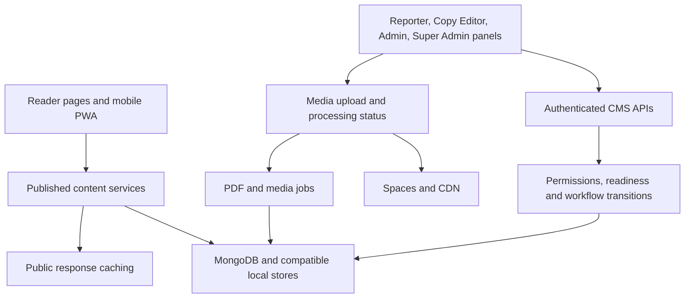

# Lokswami project 360 review

Reviewed September 5, 2026. Scope: this repository, the public site at
https://lokswami.com/main, the available live Admin session, and its Hostinger deployment.

## Outcome and scope

The current deployment is operational. The checkout contains substantial unreleased
reader, account, video, CMS, PDF, and storage work. Stabilize that work before release.
This review adds focused corrections and a practical architecture plan; it does not
claim that every function has been exhaustively audited or that all panels have been redesigned.

[Source inventory](PROJECT_360_SOURCE_INVENTORY.json) records 918 source/configuration
files, 146 API routes, 49 CMS pages, 39 reader pages, and 34 model files at inventory time.
It covers app, components, hooks, lib, scripts, tests, types, workflow configuration,
and the root application/toolchain configuration and package manifest/lockfile.
Runtime data, secrets, uploads, generated build artifacts, and dependencies are excluded.
File inclusion is structural coverage, not evidence of a manual line-by-line review.
Regenerate it with `node scripts/audit-project-structure.js`.

## Repository and production

| Check | Evidence observed |
| --- | --- |
| Local branch | `main`, with extensive pre-existing uncommitted changes |
| Local HEAD and GitHub main | `dc06def7ff3aaee8a77bbef0b8527db01f3e8b99`, verified using `git ls-remote` |
| Hostinger current deployment | Completed, branch `main`, commit `dc06def7` |
| Deployment time shown by Hostinger | August 20, 2026, 13:53; timezone not specified in the displayed record |
| Hosting configuration | GitHub connected, Node 20.x, Next.js, running; auto-deployment displayed |
| Runtime health | `/api/health`: healthy, MongoDB connected |
| Backups | Hostinger displays Daily; restore capability was not exercised |
| Public assets | 30 distinct Next.js JS/CSS assets passed checks across four sampled routes |
| SEO | Robots and both article sitemaps fetched; sampled article had canonical, substantive H1, server HTML body, and related links |
| CMS guest boundaries | Seven pages redirected to sign-in; eight APIs returned expected unauthorized/forbidden responses |

No commit, push, deployment, content publication, account change, or backup restore
was performed during this review. A passing local build does not make the uncommitted
checkout the production version.

## Changes made during this review

| Area | Problem | Correction |
| --- | --- | --- |
| Reader homepage | An empty/unavailable public feed could substitute demo articles | Initialize with real feed data or an empty list; fallback uses the public articles API; show a loading/unavailable message |
| Public video feed | The home-feed mapper trusted the legacy publication flag without full workflow/processing checks | Reuse `toPublicVideoItem` and the shared Mongo projection; exclude drafts, future publication, failed/processing media, and landscape Shorts |
| Older articles | Mongo cursor filtering happened after the bounded candidate query | Put timestamp and ID cursor conditions into the Mongo query, preserving stable ordering before limiting results |
| E-paper story modal | `useArticleTts` ran after a conditional return, violating hook ordering | Mount a separate content component only for an open story; key it by story identity so switching/closing cleans up the previous instance |
| Modal accessibility | Reading mode buttons did not expose selection state | Add `aria-pressed` for Visual/Text |
| All CMS roles | Long tool lists required scanning multiple sections | Add bilingual `Find newsroom tools` search over already-permitted links, with an empty result and Clear search action |
| CMS navigation | Route changes lacked a shared loading view | Add a newsroom route loading screen with accessible status and reduced-motion support |
| Release verification | `verify:deploy` invoked a deleted TTS script | Run existing SEO smoke checks between runtime and guest-boundary checks; remove the dead npm TTS command |
| Test reliability | Default worker count produced resource-contention failures on this machine | Bound Vitest to four workers; baseline 903 tests then passed without increasing timeouts |
| Test coverage | A homepage assertion ended with `|| true` | Replace it with a real story-link assertion and add publication, navigation-search, modal-lifecycle, and pagination regressions |
| Maintenance | No current structural inventory | Add `audit:structure`, including detection of missing npm script targets |

The deployed Special Report card was observed combining one article title with another
article headline. The local homepage already no longer renders that band. Its retained,
currently unused component was corrected to use the same article's summary.

## Verification

- Baseline: 903 tests passed in 194 files with four workers. The initial unconstrained
  run had 11 failures, several timeouts; they did not reproduce with bounded workers.
- After the primary changes: `npm run test:ci` passed 909 tests in 195 files, seven auth
  guard cases, and the admin credentials regression checks.
- The later pagination regression passed with the public article service/API tests
  (16 tests), including 85 stories and equal-timestamp page boundaries.
- Modal lifecycle tests passed again after correcting their TypeScript query options.
- TypeScript passed after the modal and pagination changes. Focused lint passed for
  the final pagination, inventory script, loading screen, and modal test files.
- Lint: zero errors, 163 warnings. Warnings remain, including unused imports/variables,
  image guidance, and test typing. This is not a clean strict-lint claim.
- The repository's tracked dependency-advisory check passed; this is not a full external security audit.
- `npm run build:ci` succeeded: 172 static pages generated. Compiler time was 8.5 minutes
  on this machine. The final `npm run build:next` also exited successfully after the
  subsequent refinements; its emitted server module was inspected to confirm that
  Mongo cursor conditions precede the candidate limit.
- `node scripts/verify-deploy.js https://lokswami.com --timeoutMs=20000` passed all
  runtime, SEO, asset, and CMS guest checks against the existing production deployment.
- Local reader browser: mobile document width matched scroll width (380 px), with
  bottom navigation visible and no captured client errors. Drawer opening, Escape
  dismissal, and article share options were exercised without sending a share.
- Live CMS: all 20 tools visible to the signed-in Admin role were opened. This proves
  route access/rendering, not successful write actions in every workflow.
- Local authenticated CMS visual verification depends on local sign-in. Search behavior
  and reporter permission isolation are covered by component tests.

Local Node was 24.13.0; production uses 20.x. Repeat CI with the repository's configured
Node 20 before release. The build configuration skips its own lint/type gates, so the
separate lint and TypeScript commands remain mandatory.

## Live CMS coverage

Dashboard, Work Queue, Push Alerts, Copy Desk, Team, Operations Center, Articles,
Stories, Videos, Social Posts, E-Papers, E-Magazines, Media, Polls, Categories,
Contact Messages, Analytics, AI Ops, Elections, and Newsroom Settings were opened.

The live article screen exposes All Articles, Review Queue, Assigned To Me, My Articles,
title/author/category/assignee search, status/category/source filters, and Create Direct
Article. The monthly E-Magazine desk exposes an issue-month field and separate status
and production-stage filters. These distinctions should survive future simplification.

Reporter, Copy Editor, and Super Admin capabilities were inspected through repository
permissions/navigation/workflow tests. They were not separately impersonated in production.
No live draft, upload, deletion, assignment, or publish action was submitted.

## Public response samples

One unauthenticated request per route at approximately 09:00 UTC on September 5.
These are HTTP samples from this machine, not Core Web Vitals, percentiles, or a before/after benchmark.

| Route | Status | Time to headers | Total | Decoded HTML size |
| --- | --- | ---: | ---: | ---: |
| `/main` | 200 | 1,525 ms | 1,564 ms | 219,592 bytes |
| `/main/latest` | One 20-second timeout; repeat 200 | Repeat 887 ms | Repeat 989 ms | Repeat 346,983 downloaded bytes |
| `/main/search` | 200 | 551 ms | 593 ms | 109,696 bytes |
| `/main/epaper` | 200 | 442 ms | 495 ms | 171,971 bytes |
| `/main/e-magazine` | 200 | 186 ms | 201 ms | 137,551 bytes |
| `/main/videos` | 200 | 142 ms | 156 ms | 139,598 bytes |

The latest-page timeout needs repeated monitoring and server traces before assigning
a cause. Hostinger's displayed speed scores were from August 12; they were not treated
as current measurements. Local build output reported 187 kB first-load JS for `/main`,
354 kB for article creation, and 358 kB for article editing in the first build.

## Architecture direction

Keep the existing Next.js modular monolith and improve its boundaries incrementally:

1. **Publication domain:** Reader pages and APIs consume the same published-only
   article/video/publication services. Keep workflow/readiness checks outside UI
   components. Audit remaining legacy demo fallbacks before migrating more readers.
2. **CMS composition:** Split large editors into Compose, Media, SEO, Readiness,
   Workflow, and revision/locking hooks using the existing shared editor/layout seams.
   First preserve behavior and tests; then reduce screens per role.
3. **Persistence:** Treat MongoDB as production authority. File stores support local
   and explicit degraded operation. Define what may fall back, how source is reported,
   and how writes are reconciled. Process-local locking is insufficient for independent
   production replicas; validate Redis failure behavior before scaling horizontally.
4. **Heavy work:** Continue isolating PDF work. Move long conversion/OCR/media tasks
   behind durable jobs with retry status and idempotency before growing processing load.
   Measure resource use before provisioning additional infrastructure.
5. **Reader performance:** Keep useful first-page HTML, published anchors, media sizing,
   bounded pagination, and cache invalidation on publication. Load optional editor and
   video features on demand. Establish repeatable mobile measurements before setting
   performance claims or comparing releases.
6. **Observability:** Track page/API latency, failed uploads, stale locks, job failures,
   and publication failures with a release identifier. Keep monitoring separate from
   reader-facing UI. Prove backup restoration and rollback in an isolated environment.

## Prioritized remaining work

| Priority | Work | Acceptance evidence |
| --- | --- | --- |
| P1 | Integrate and review the pre-existing uncommitted account, Swipe, storage, locking, and PDF changes in bounded releases | Exact changed-file review, Node 20 CI, isolated role walkthroughs, rollback package |
| P1 | Recheck query deadlines, cursor behavior and fallback provenance across all public feeds | Mongo/file parity tests; deep pagination; controlled dependency failure tests |
| P1 | Review headline/flag consistency and remove remaining reader demo-data paths | Published-only server HTML and hydrated feeds; Breaking in Live Updates, Trending in Popular News with backfill |
| P1 | Reporter/mobile publishing acceptance | Title, body, media, submit flow; draft recovery; failed upload retry; Send to Copy Editor; permission-denied cases |
| P1 | Durable publication/media operations | No double publish; safe retries; lease expiry/recovery; two-writer storage tests; real storage and backup/restore checks |
| P2 | Decompose article, story, and E-paper editors | Same UI labels, permissions and workflow tests; smaller modules; measured loading improvement |
| P2 | Reduce recurring lint warnings | Address hook dependencies and accessibility first; remove dead code after usage review |
| P2 | Simplify role dashboards and counts | Labels link to the exact represented queue; consistent owner, status, blocker, next action |
| P2 | Repeatable performance monitoring | Mobile browser runs and production traces; explain timeout outliers; compare identical content/builds |

The largest inventoried application files are article editing (3,890 lines), the E-paper reader
(3,188), story editing (3,069), E-paper page editing (2,900), article creation (2,684),
and the article API route (2,286). These are decomposition candidates, not proof that
file length alone is the cause of slow performance.

## CMS navigation SOP for this change

1. Sign in with your existing newsroom role and open `/admin`.
2. On mobile, open navigation. Desktop shows the sidebar directly.
3. Use **Find newsroom tools** (Hindi: **न्यूजरूम टूल खोजें**). Search in Hindi or English;
   for example, `Articles`, `Media`, or `ई-मैग`.
4. Open the result. Search only considers tools permitted for your role; it does not
   grant access or change backend permissions. The mobile quick navigation stays available.
5. If there are no results, use **Clear search** to restore your permitted tools.

Continue using [Article creation SOP](ARTICLE_CREATION_SOP.md) and
[CMS role SOP](LOKSWAMI_CMS_ROLE_SOP.md) for publication steps. E-paper stays daily and
city/edition based; E-magazine stays monthly and issue based.
